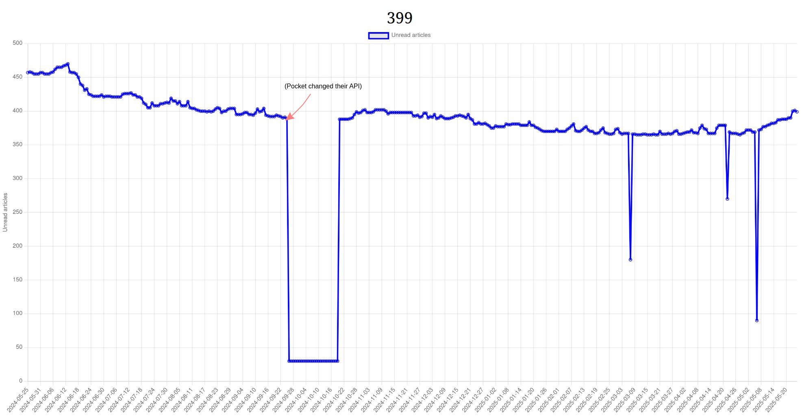

# Pocket Counter

> :warning: since [Mozilla announced][pocket-shutdown] that Pocket will be shut down,
this repository will be archived. May you not accumulate too many interesting
articles to read, using whatever other read-it-later application.

I save to [Pocket][pocket] too many articles to read later,
with respect to the ones I actually have time to read.

This is a simple web application to visualize how the number of unread
items in my Pocket account changes in time, to keep this tendency in check.

 [pocket]: https://getpocket.com/
 [pocket-shutdown]: https://support.mozilla.org/en-US/kb/future-of-pocket